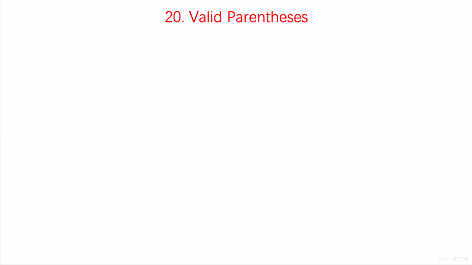

# 20.有效的括号
[原题地址](https://leetcode-cn.com/problems/valid-parentheses/)
## 题目
给定一个只包括 '('，')'，'{'，'}'，'['，']' 的字符串，判断字符串是否有效。

有效字符串需满足：

左括号必须用相同类型的右括号闭合。
左括号必须以正确的顺序闭合。
注意空字符串可被认为是有效字符串。

示例 1:
```md
输入: "()"
输出: true
```

示例 2:
```md
输入: "()[]{}"
输出: true
```

示例 3:
```md
输入: "(]"
输出: false
```

示例 4:
```md
输入: "([)]"
输出: false
```

示例 5:
```md
输入: "{[]}"
输出: true
```

## 动画演示


## 解题思路
看动画。大概思路就是：<br/>
1.遇见`{`, `[`, `(`左括号就推进栈（stack）<br/>
2.遇见`}`, `]`, `)`右括号就出栈<br/>
3.最后判断栈（stack）是否为空，为空就表示匹配成功<br/>


注意：每一个右括号必须和当前栈尾的元素是能匹配的，举例：
```md
输入：'{[(])}'
上面这样的虽然左括号和右括号都能匹配到，但他们不是有效的括号<br/>
输出： false
```

## 实现代码
```js
var isValid = function(s) {
  let hashMap = {
    "{": "}",
    "[": ']',
    "(": ")"
  };
  let strck = [];
  for (let i = 0; i < s.length; i++) {
    if(hashMap[s[i]]) {
      // 如果匹配到了左括号，就推入栈（stack）中
      strck.push(s[i]);
    } else {
      // 取出栈尾数组，通过对象映射，判断是否和当前字符相等
      // 如果不相等，说明不是匹配的字符串，直接return false
      if(hashMap[strck.pop()] !== s[i]) {
        return false;
      }
    }
  };
  return strck.length > 0 ? false : true 
};
// 执行用时 :64 ms, 在所有 JavaScript 提交中击败了76.70%的用户
// 内存消耗 :34.4 MB, 在所有 JavaScript 提交中击败了47.83%的用户
// 时间复杂度: On
// 空间复杂度: On
```


